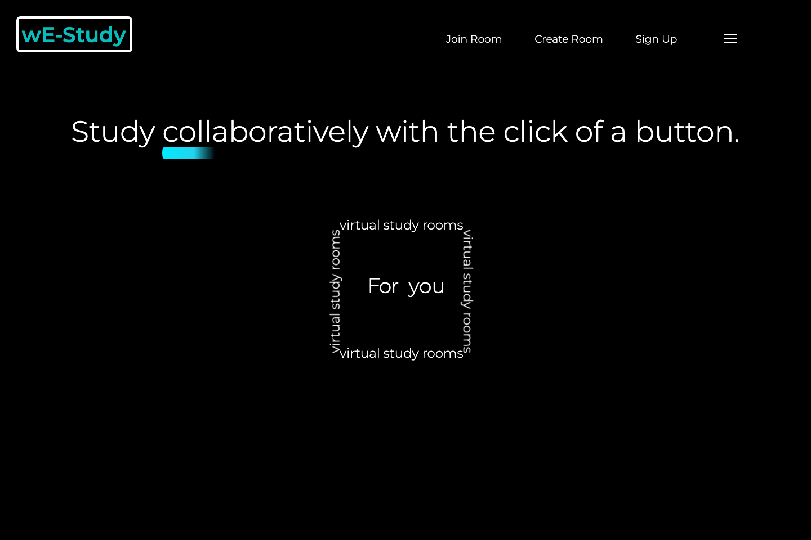

# wE-Study

A web app for organizing study sessions. Students can create or join study rooms, share meeting links, and browse study resources.

[Website](https://we-study.free.je/)



## Stack

HTML, CSS, and JavaScript on the frontend; PHP and MySQL on the backend. The database stores accounts and study sessions. Shared helpers in `html/db.php` handle the database connection and password verification using bcrypt hashes.

## Run locally

Requires PHP 8 with `mysqli` and a MySQL database.

1. Create a database and import `schema.sql` into it.
2. Copy `html/config.sample.php` to `html/config.php` and fill in your database host, username, password, and database name. The config file is gitignored.
3. From the project directory, start the server:

```bash
php -S localhost:8000
```

Open http://localhost:8000 and create an account. The sample config describes the original InfinityFree hosting setup; a local MySQL instance works with the same constants.

## Code map

- `index.html`: public homepage.
- `html/`: account, room, and resource pages and their PHP handlers.
- `css/` and `js/`: shared styling and browser behavior.
- `schema.sql`: database tables for accounts and study rooms.

## Check PHP syntax

```bash
find html -name '*.php' -exec php -l {} \;
```

If the public host is unavailable, use the local setup.
